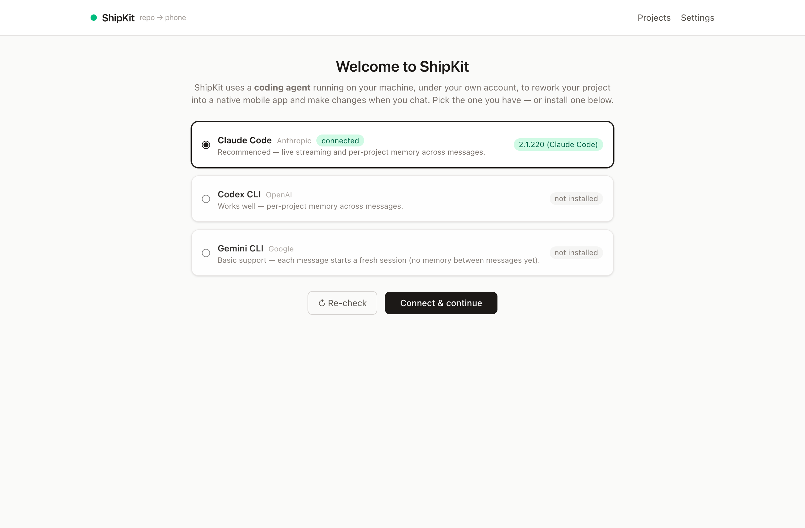
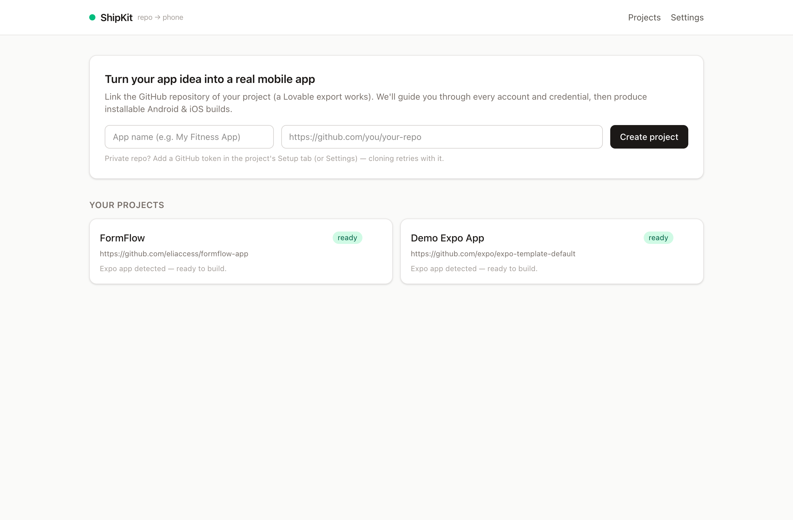
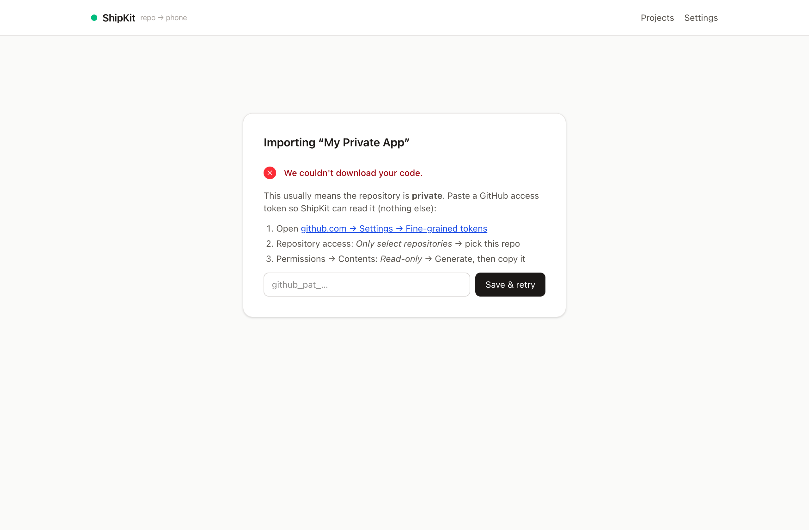
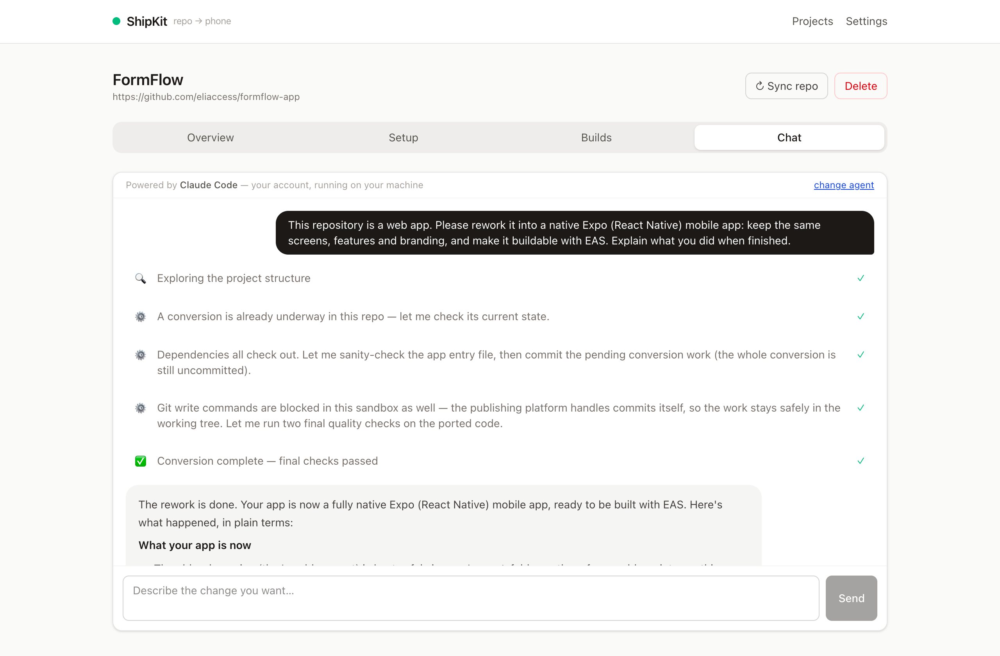
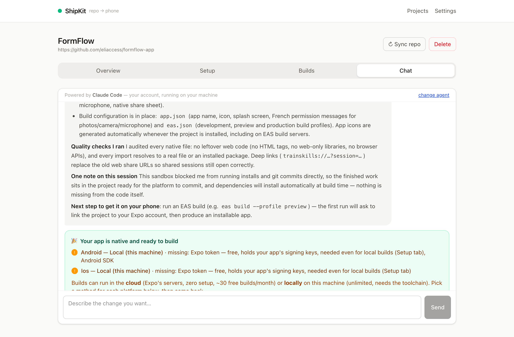
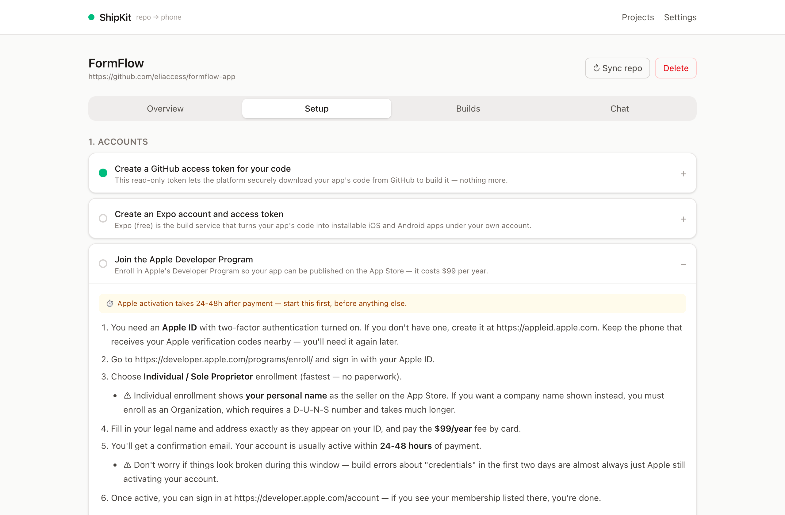
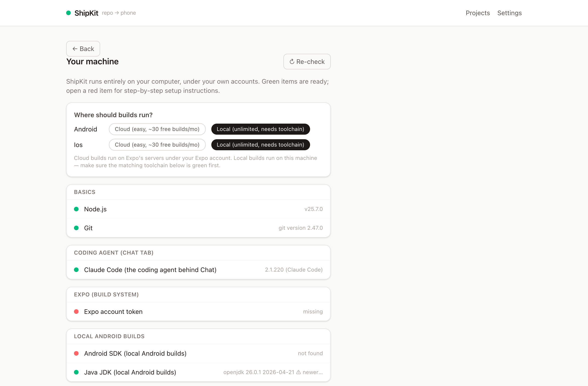

# ShipKit — turn your Lovable project into a real mobile app

**Open source, runs on your computer, everything under your own accounts.**

You vibe-coded an app in Lovable (or you have any GitHub repo). Getting from there to an app
people can actually install is the step that stops non-technical makers: native code, sensor
permissions, signing keys, store rules, developer accounts. **ShipKit exists to let you finish
that last step yourself** — no agency, no freelancer, no terminal. Your own coding agent
reworks the web app into a native Expo app, a guided wizard walks you through every account
and credential (Apple, Google Play, Expo…), and you get installable Android builds and
TestFlight-ready iOS builds — from your own machine.

## What ShipKit handles for you

Converting a web app into a *packaged, store-ready* mobile app is mostly invisible work.
ShipKit puts an abstraction layer over all of it:

- **📱 True native conversion** — your web app is regenerated as a real Expo (React Native)
  app: same screens, same branding, native components. Never a web page in a wrapper, which
  Apple rejects outright (guideline 4.2).
- **🔐 Sensors & permissions** — camera, microphone, photo library, location: the agent wires
  the native permission declarations and the user-facing purpose strings both stores require,
  in your app's language.
- **🇪🇺 GDPR & privacy** — data flows are reviewed during conversion, legal/consent screens
  are carried over natively, and the setup wizard covers the privacy questions the stores ask.
- **🏪 Store compliance built in** — publishing under *your* developer accounts (required by
  Apple 4.2.6 / Play policy), deep links replacing web share URLs, icons/splash/build profiles
  generated — the checklist items that get first submissions rejected.
- **🤖 Bring your own AI** — the coding agent is yours: Claude Code, OpenAI Codex or Gemini
  CLI, on your subscription, running on your machine. ShipKit orchestrates it; every change
  narrated as a plain-language activity feed, with runs that survive network cuts.
- **🗝 Keys & credentials, kept safe** — signing keys live in your Expo account (so cloud and
  local builds stay interchangeable); pasted secrets are AES-256-GCM encrypted on your disk
  and never leave your machine.
- **🏗 Builds where you want them** — Expo's cloud (zero setup) or your own machine
  (unlimited); a readiness check tells you exactly what's missing before you can press Build.
- **🧭 The accounts maze, guided** — Apple's 24–48h activation, Google Play's 14-day closed-test
  rule, App Store Connect API keys, service accounts: step-by-step instructions written for
  non-technical people, with pasted values validated on the spot.

## A tour in screenshots

**1 — Connect your coding agent.** First launch detects what's installed (Claude Code, Codex,
Gemini) and shows install steps if nothing is:



**2 — Link your repo.** Paste the GitHub URL of your Lovable project:



**3 — Problems are diagnosed, not dumped.** A private repo doesn't fail with a git error — it
explains itself and walks you through the fix:



**4 — Watch the conversion happen.** The agent narrates every phase as it reworks your web
app into a native one — close the page, come back, it's still going:



**5 — Know when you're ready to build.** The readiness card shows the chosen build method per
platform and exactly what's missing; the build button unlocks when everything's green:



**6 — Accounts and credentials, step by step.** Each wizard step has plain-language
instructions with exact links, prices, waiting times and traps:



**7 — Your machine, checked.** Every tool needed is probed, with fix instructions for
anything missing, and the cloud/local build choice per platform:



No hosted service, no markup, no platform account in the middle:

- **Your coding agent** powers the chat — Claude Code, OpenAI Codex CLI, or Gemini CLI, whichever is installed, on your subscription/API key.
- **Your Expo account** powers builds — in Expo's cloud (free tier) or locally on your machine (unlimited). Either way it holds your app's signing keys.
- **Your Apple / Google accounts** publish the app (the stores require this anyway).
- **Your machine** stores everything; pasted credentials are AES-256-GCM encrypted in a local SQLite db.

## Quick start

```bash
git clone <this repo> && cd shipkit
npm install
cp .env.example .env   # generate ENCRYPTION_KEY as shown inside
npx prisma db push
npm run dev            # http://localhost:3000
```

First launch opens the **welcome screen**: it detects which coding agents are installed and
walks you through installing one if none is found. Then **Settings → Your machine** checks
the rest of the toolchain, with fix instructions for anything missing:

| Needed for | Tool | Notes |
|---|---|---|
| Everything | Node ≥ 20, Git | |
| Chat (the coding agent) | `claude`, `codex` or `gemini` CLI, logged in | your account, your machine |
| Builds (both modes) | Expo account + access token | free; holds the app's signing keys — needed even for local builds |
| Local Android builds | Android SDK + JDK 17–21 | cloud mode needs none of this |
| Local iOS builds | macOS + Xcode + CocoaPods | cloud mode builds iOS without a Mac |

**Cloud vs local builds** — chosen per platform in Settings. Cloud runs on Expo's servers
(~30 free builds/month, zero setup). Local runs `eas build --local` on your machine:
unlimited and free, artifacts served straight from disk.

## The flow

1. **Link a repo** — the import screen shows real progress, and if the download fails
   (private repo, bad URL) it diagnoses the problem and walks you through the fix inline.
2. **Rework it with the agent** — Lovable exports are web apps; Apple rejects thin web
   wrappers. The import screen detects this and offers "Rework it with AI": your agent
   regenerates the app natively (same screens, same branding), narrating progress as an
   emoji activity feed. Runs execute server-side and every step is saved — close the page,
   come back, the run is still there.
3. **Setup wizard** — step-by-step, non-technical instructions for the Apple Developer
   Program (start first: 24–48h activation), Play Console (incl. the 14-day closed-test
   rule), App Store Connect API key, Play service account, app identity. Values are
   validated on paste and steps turn green from *evidence* (a token saved anywhere counts).
4. **Build** — the chat shows a readiness card (per-platform method + what's missing) and
   unlocks the build button when everything's set. Android yields a direct APK download
   link; iOS signs with your ASC key and installs via TestFlight.
5. **Iterate** — keep chatting; rebuild when you're happy.

## Architecture (for contributors)

Next.js 15 (App Router) + Prisma/SQLite, no external services:

- `src/lib/jobs.ts` — DB-backed job queue polled in-process (`src/instrumentation.ts`), 2 concurrent, orphan recovery on restart.
- `src/lib/agents.ts` — coding-agent registry + detection (Claude Code / Codex / Gemini).
- `src/lib/chat/agent.ts` — per-agent adapters: spawns the CLI headless in the project workspace (Claude: `stream-json` + session resume + safe-command allowlist; Codex: `exec --json` + resume; Gemini: basic).
- `src/lib/chat/runs.ts` — detached chat runs: persists emoji step lines and the final summary, re-detects the project kind after each run.
- `src/lib/builds/eas.ts` — build runner: cloud (`--json --wait`, artifact URL from EAS) or local (`--local --output`, artifact served from `storage/artifacts/`).
- `src/lib/wizard/` — step definitions + validation; instruction content in `content.json`; completion derived from stored evidence.
- `src/lib/doctor.ts` — machine checks (parallel probes, 60s cache) behind Settings → *Your machine*, the chat readiness card, and the welcome screen.
- `src/lib/crypto.ts` — AES-256-GCM for credentials at rest (`ENCRYPTION_KEY` in `.env`).

Everything user-generated lives outside git: `prisma/dev.db*` (projects, encrypted
credentials, chat history) and `storage/` (cloned repos, build artifacts, logs).

## Roadmap

- [ ] OTA updates (`eas update`) after chat changes — see edits on your phone in seconds without rebuilding
- [ ] One-click `eas submit` to TestFlight / Play internal testing
- [ ] Live verification of pasted credentials (ping ASC / Play APIs)
- [ ] Store-listing generator (screenshots, privacy questionnaire answers)
- [ ] Fully offline build mode (no Expo account: `expo prebuild` + Gradle/Xcode, keystore in the local vault) — opt-in, for advanced users
- [ ] Packaged desktop app (Tauri/Electron) so non-technical users skip the Node/Git install

MIT licensed — see [LICENSE](./LICENSE).
